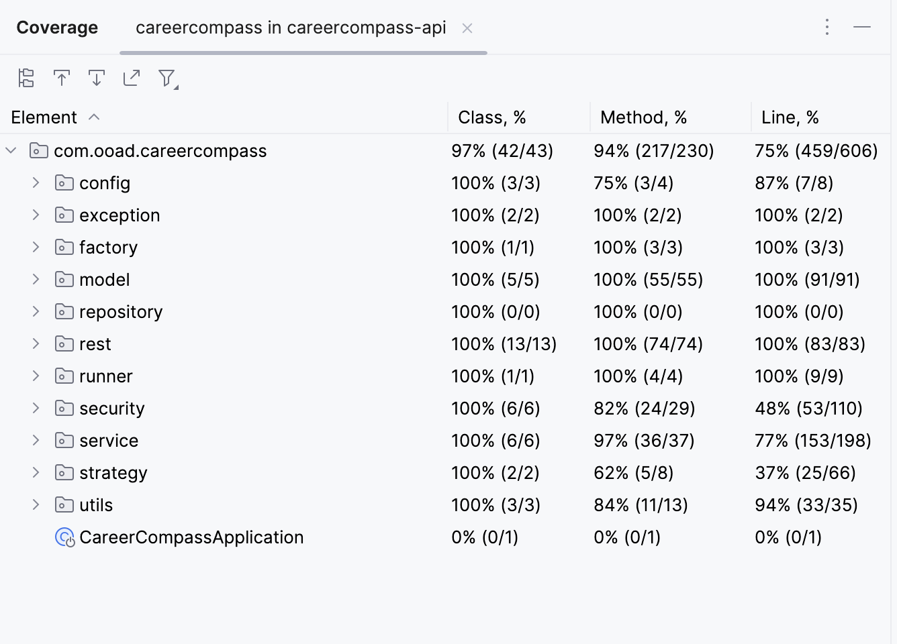

# CareerCompass

CareerCompass is a web-based application designed to revolutionize the way job seekers manage their job search process.
Our goal is to develop a powerful and user-friendly tool that simplifies and streamlines job application tracking. With CareerCompass, users can create personalized job search tags, maintain a comprehensive list of companies they wish to apply to, track application statuses, and store relevant information for each application.
## Team Members
1. Sagar Swami Rao Kulkarni (saku8738)
2. Pavan Sai Appari (paap9049)

## Links
- Project Summary PDF Link:   [Project Summary](./backend/assets/pdfs/Project8Update.pdf)
- UML Class Diagram Link:   [UML Class Diagram](./backend/assets/images/backend-UML-class-diagram.png)

## Getting Started
1. Clone the repository: `https://github.com/sagarswamiraokulkarni/career-compass.git`
2. Install dependencies:
   - Frontend:
   - `cd frontend`
   - `npm install`
   - Backend:
   - `cd backend`
   - `mvn install`
3. Start the application:
   - Frontend:
   - `cd frontend`
   - `npm start`
   - Backend:
   - `cd backend`
   - `mvn spring-boot:run`
4. Access the application at `http://localhost:3000`

## Status Summary:
- Below is the link for Status Summary of our application:
- Status Summary PDF Link:   [Status Summary](./backend/assets/pdfs/Project%207%20Update.pdf)

## UML Class Diagram:
- We intend to create the NotificationFactory class, which will provide the required object instances for SMS, Call, and Email Notification classes.
- Note: the term 'Notification' is used because in the future, we plan to further develop the project and send different types of notification events to the users.
- Below is the Image file containing the UML Diagram of the classes(please download the Image from location (`./backend/assets/images/backend-UML-class-diagram.png`) and zoom in, the document is of high quality and all the class diagrams will be clearly visible)
- UML Class Diagram Link:   [UML Class Diagram](./backend/assets/images/backend-UML-class-diagram.png)

## BDD Scenarios:

- Job Application Management feature:
```java
Feature: Job Application Management

  Scenario: Create a new job application
    Given an user with registered email fireflies186@gmail.com
    When the user submits a request to create a new job application
    Then the application should add the job application successfully
    And the application should return a success message

  Scenario: Retrieve all the job applications
    Given an user with registered email fireflies186@gmail.com
    When the user requests to view all unarchived job applications
    Then the application should return a list of unarchived job applications

  Scenario: Retrieve a specific job application
    Given an user with registered email fireflies186@gmail.com
    And a existing job application with ID 2
    When the user requests to view the job application with ID 2
    Then the application should return the details of the job application

  Scenario: Update an existing job application
    Given an user with registered email fireflies186@gmail.com
    And an existing job application with ID 2
    When the user submits a request to update the job application with ID 2
    Then the application should update the job application successfully
    And the application should return a success message

  Scenario: Delete/Archive a job application
    Given a user with registered email fireflies186@gmail.com
    And an existing job application with ID 2
    When the user requests to archive/delete the job application with ID 2
    Then the application should archive the job application successfully
    And the application should return a success message

  Scenario: Star a job application
    Given a user with registered email fireflies186@gmail.com
    And an existing job application with ID 2
    When the user requests to star the job application with ID 2
    Then the application should mark the job application as starred
    And the application should return a success message
```
- In this "Job Application Management" feature, we have defined several scenarios that cover different aspects of managing job applications within the system.

- One of the scenarios is "Create a new job application". This scenario describes the process of a user successfully creating a new job application. It specifies the precondition of having a user with a specific ID and the action of the user submitting a request to create a new job application. The expected outcome is that the system successfully adds the job application and returns a success message.

- Another scenario is "Retrieve all unarchived job applications". This scenario focuses on the functionality of retrieving a list of all unarchived job applications for a specific user. It defines the precondition of having a user with a specific ID and the action of the user requesting to view all unarchived job applications. The expected result is that the system returns a list of unarchived job applications.

- Similarly, the "Retrieve all archived job applications" scenario describes the process of retrieving a list of all archived job applications for a specific user. It follows a similar structure to the previous scenario but focuses on archived job applications instead.

- The "Retrieve a specific job application" scenario illustrates the functionality of retrieving the details of a specific job application. It specifies the preconditions of having a user with a specific ID and a job application with a specific ID. When the user requests to view the job application with the given ID, the system is expected to return the details of that job application.

- The "Update an existing job application" scenario describes the process of updating the information of an existing job application. It specifies the preconditions of having a user with a specific ID and an existing job application with a specific ID. When the user submits a request to update the job application, the system is expected to update the job application successfully and return a success message.

- The "Archive a job application" and "Unarchive a job application" scenarios focus on the functionality of archiving and unarchiving job applications, respectively. They define the preconditions of having a user with a specific ID and an existing job application with a specific ID. When the user requests to archive or unarchive the job application, the system is expected to perform the corresponding action successfully and return a success message.

- Lastly, the "Star a job application" scenario describes the process of marking a job application as starred. It specifies the preconditions of having a user with a specific ID and an existing job application with a specific ID. When the user requests to star the job application, the system is expected to mark the job application as starred and return a success message.

- User Authentication and Registration feature:
```java
Feature: User Authentication and Registration

  Scenario: User login with valid credentials
    Given a user with email "fireflies186@gmail.com" and password "Admin@123"
    When the user submits valid login credentials
    Then the application should authenticate the user successfully
    And the application should generate a JWT token
    And the application should return the authentication response with the token

  Scenario: User login with invalid credentials
    Given a user with email "fireflies186@gmail.com" and password "wrongpassword"
    When the user submits invalid login credentials
    Then the application should reject the authentication attempt
    And the application should return an error message

  Scenario: User sign up with existing email
    Given a user with email "fireflies186@gmail.com" already exists
    When a new user attempts to sign up with the same email
    Then the application should reject the sign-up request
    And the application should return an error message
```
- In this "User Authentication and Registration" feature, we have defined scenarios related to user login and sign-up processes.

- The "User login with valid credentials" scenario describes the process of a user successfully logging in with valid credentials. It specifies the precondition of having a user with a specific email and password. When the user submits valid login credentials, the system is expected to authenticate the user successfully, generate a JWT token, and return the authentication response with the token.

- On the other hand, the "User login with invalid credentials" scenario focuses on the case when a user attempts to log in with invalid credentials. It specifies the precondition of having a user with a specific email and an incorrect password. When the user submits invalid login credentials, the system is expected to reject the authentication attempt and return an error message.

- Lastly, the "User sign up with existing email" scenario describes the case when a new user attempts to sign up with an email that already exists in the system. It specifies the precondition of having a user with a specific email already registered. When a new user attempts to sign up with the same email, the system is expected to reject the sign-up request and return an error message.


## Testing
- Achieved 94% test method coverage for implemented methods
- Below is the screenshot of test coverage showing 94% for methods.
  


## Technologies Used
- React : Frontend development
- Java with SpringBoot: Backend development
- MySQL: Database management system

## Features
- User Registration and Verification: Users can register with their personal details and verify their account via email, phone, or Call.
- User Login: Registered users can securely log into the application using their credentials.
- Tag Creation and Management: Users can create, update, and manage tags to categorize their job applications.
- Job Application Creation: Users can create detailed job application records with information such as company name, role, status, and associated tags.
- Job Application Management: Users can edit, star/unstar, filter, archive, and unarchive their job applications for effective tracking and organization.
- Secure Authentication: The application implements secure authentication using bearer tokens to protect user data and ensure authorized access.
- REST API for Data Access and Manipulation: The backend provides a REST API for seamless data access and manipulation, enabling smooth interaction between the frontend and backend.
- Error Handling: The application handles errors gracefully, providing informative error messages and maintaining a smooth user experience.
- User-Specific Data Management: Each user's data, such as tags and job applications, is associated with their account, ensuring privacy and personalized management.


## Issues/Challenges Faced and Solutions
### Issue 1:
- Problem: Setting multiple fields of the Job Application object using individual setter methods was cumbersome, error-prone, and led to complex object creation and potential data inconsistencies.
- Solution: We overcame this challenge by implementing the Builder Pattern with a fluent interface, which improved code readability, maintainability, and testability by separating the construction logic and ensuring immutable and consistent Job Application objects.
### Issue2:
- Problem: Implementing multiple verification methods (Email, Call, SMS) in the backend resulted in conditional logic and tightly coupled code, making it difficult to maintain and extend the verification functionality.
- Solution: We addressed this issue by applying the Strategy Pattern, encapsulating each verification method into separate strategy classes with a common interface. This decoupled the verification logic, improved code modularity and maintainability, and enabled seamless integration of new verification methods.

## Design Patterns
1. Singleton Pattern:
```java
   public static synchronized CareerCompassUtils getInstance(){
        if(careerCompassUtils==null) careerCompassUtils = new CareerCompassUtils();
        return careerCompassUtils;
    }
```
- The Singleton Pattern was applied to the CareerCompassUtils class to ensure that only one instance of the class exists throughout the application.
- The constructor is made private to prevent direct instantiation, and a static synchronized getInstance() method is provided to retrieve the single instance of the class.
- This pattern is useful for utility classes or classes that need to maintain a global state across the application.
2. Factory Pattern :
```java
public class NotificationFactory { 
    public static NotificationStrategy getEmailNotificationStrategy(){
        return new EmailNotificationStrategy();
   }
    public static NotificationStrategy getSMSNotificationStrategy(){
        return new MessageNotificationStrategy("sms");
    }
    public static NotificationStrategy getCallNotificationStrategy(){
        return new MessageNotificationStrategy("call");
    }
}
```
- The Factory Pattern was utilized to create notification strategy objects (email, SMS, Call) based on user preferences.
- The NotificationFactory class provides static methods to retrieve the appropriate notification strategy, abstracting the object creation process and allowing for easy extensibility.

3. Strategy Pattern:
```java
public NotificationStrategy getNotificationStrategy(String strategyType){
    return switch (strategyType) {
        case "sms" -> NotificationFactory.getSMSNotificationStrategy();
        case "call" -> NotificationFactory.getCallNotificationStrategy();
        case "email" -> NotificationFactory.getEmailNotificationStrategy();
        default -> throw new RuntimeException("Invalid verification type");
    };
}
```
- The Strategy Pattern was implemented for handling different notification strategies (Email, SMS, Call).
- Each notification strategy is encapsulated in a separate class (EmailNotificationStrategy, MessageNotificationStrategy) that implements the NotificationStrategy interface.
- This allows for flexible and interchangeable usage of notification strategies without modifying the client code.

4. Facade Pattern:
```java
@PostMapping("/sendVerificationChallenge")
public GenericResponse sendVerificationChallenge(@Valid @RequestBody VerificationRequest verificationRequest) {
   accountService.checkIfRegistrationIsCompleted(verificationRequest);
   return accountService.sendVerificationChallenge(verificationRequest);
}

@PostMapping("/validateChallenge")
public GenericResponse validateChallenge(@Valid @RequestBody VerificationRequest verificationRequest) {
   accountService.checkIfRegistrationIsCompleted(verificationRequest);
   return accountService.validateVerificationChallenge(verificationRequest);
}

```
- The Facade Pattern was applied in the account service to simplify the process of sending and validating verification challenges.
- The facade methods (sendVerificationChallenge, validateChallenge) provide a simplified interface for clients, encapsulating the complexity of the underlying subsystems.
- This pattern promotes loose coupling and improves maintainability by reducing dependencies between clients and the internal workings of the verification process.

5. Builder Pattern:
```java
private JobApplication(Builder builder) {
   this.id = builder.id;
   this.user = builder.user;
   this.company = builder.company;
   this.position = builder.position;
   this.status = builder.status;
   this.applicationDate = builder.applicationDate;
   this.updatedAt = builder.updatedAt;
   this.companyUrl = builder.companyUrl;
   this.starred = builder.starred;
   this.isArchived = builder.isArchived;
   this.notes = builder.notes;
   this.createdAt = builder.createdAt;
   this.jobTags = builder.jobTags;
}


public static Builder builder() {
   return new Builder();
}


JobApplication jobApplication=JobApplication.builder().applicationDate(new Date().toInstant().atZone(ZoneId.systemDefault()).toLocalDate())
       .company(requestJobApplicationDto.getCompany()).createdAt(new Timestamp(System.currentTimeMillis())).isDeleted(false)
       .companyUrl(requestJobApplicationDto.getCompanyUrl()).starred(false).position(requestJobApplicationDto.getPosition())
       .user(user).position(requestJobApplicationDto.getPosition()).status(requestJobApplicationDto.getStatus())
       .starred(requestJobApplicationDto.getStarred()).notes(requestJobApplicationDto.getNotes()).build();

```
- The Builder Pattern was employed for constructing JobApplication objects.
- The JobApplication class has a private constructor and a static builder method that returns a Builder instance.
- The Builder class allows for step-by-step construction of JobApplication objects, setting each field independently.
- This pattern enhances readability, reduces the likelihood of errors, and provides a cleaner way to create objects with many optional fields.

## Design Patterns (Defined/ Implemented At)
The above design patterns defined/implemented can be found at:

1. Singleton Pattern(CareerCompassUtils.java)
2. Factory Pattern (NotificationFactory.java)
3. Strategy Pattern (AccountService.java)
4. Facade Pattern (AuthController.java)
5. Builder Pattern (JobApplicationService.java)

If in case you wish to view the interim status of our application please view main branch of this repository : [Click Here](https://github.com/sagarswamiraokulkarni/career-compass/tree/main)
