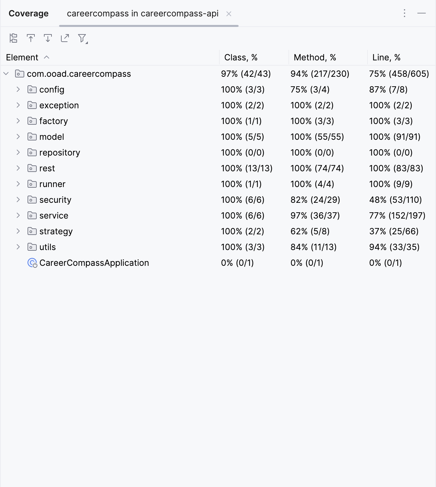

# CareerCompass

CareerCompass is a web-based application designed to revolutionize the way job seekers manage their job search process. 
Our goal is to develop a powerful and user-friendly tool that simplifies and streamlines job application tracking. With CareerCompass, users can create personalized job search tags, maintain a comprehensive list of companies they wish to apply to, track application statuses, and store relevant information for each application.
## Team Members
1. Sagar Swami Rao Kulkarni (saku8738)
2. Pavan Sai Appari (paap9049)

## Getting Started
1. Clone the repository: `https://github.com/sagarswamiraokulkarni/career-compass.git`
2. Install dependencies:
   - Frontend: 
   - `cd frontend` 
   - `npm install`
   - Backend: 
   - `cd backend`  
   - `mvn install`
3. Start the application:
   - Frontend: 
   - `cd frontend`  
   - `npm start`
   - Backend: 
   - `cd backend`  
   - `mvn spring-boot:run`
4. Access the application at `http://localhost:3000`


## Technologies Used
- React + JavaScript: Frontend development
- Java with SpringBoot: Backend development
- MySQL: Database management system

## Features

### Frontend
- Registration: Users can register using their first name, last name, email address, and phone number. 
They are given the option to verify their account using their email address, phone number, or WhatsApp. 
For phone number and WhatsApp verification, an OTP is provided, which needs to be validated. 
When email verification is chosen, a verification link is sent, and upon clicking the link, the user is successfully registered.
- Login: After successful registration, users can log into the application using their credentials.
- Tags: Upon entering the application, users can create tags that they can later use to categorize their job applications.
- Job Application Creation: Users can create job applications by entering fields such as company name, job URL, role, application date, status, notes, and tags to which they want to attach the job application.
- Job Application Management: Users have the ability to edit job applications and star/unstar them. They can also filter job applications based on the tags attached to them. Additionally, users can archive job applications they no longer wish to actively track and unarchive them if needed.

### Backend
- Controllers have been created to manage REST API calls for the above-mentioned functionalities.
- Signup: Upon signup, the system checks if the user has already registered with the provided email. If not, it saves the user object to the database and sends a success status to the application.
- sendVerificationChallenge: This endpoint checks if the user with the provided email has already registered and if the email is already verified. If verification is not done, it proceeds with the chosen verification strategy (email, phone, or WhatsApp), and based on the strategy, an email verification link or OTP is provided to the user.
- validateChallenge: This endpoint validates the user's input payload and sends a success status accordingly. It also checks for duplicate emails and throws an error if the user has already registered.
- All other controllers, apart from the above-mentioned ones, require a bearer authentication token, which is sent to the user upon successful login. The user has to send the bearer token for authentication.
- createTag, updateTag, getAllTags: These controllers handle creating tags, updating tag names, and retrieving all tags created by the user. The user can call these APIs as required.
- inbox/userid, createJobApplication, getJobApplication/{userId}/{jobApplicationId}, updateJobApplication, updateJobApplicationStarStatus/{userId}/{jobApplicationId}: These controllers handle sending all job applications created by the user, creating a new job application, retrieving a particular job application, updating a job application, and updating the star status of a job application. The user can access these endpoints accordingly.
- archiveJobApplication/{userId}/{jobApplicationId}, unarchiveJobApplication/{userId}/{jobApplicationId}: These controllers allow users to archive and unarchive job applications. When a job application is archived, it is no longer actively tracked but remains in the user's records. Unarchiving a job application restores it to the active state.

## Design Patterns
1. Singleton Pattern:
```java
   public static synchronized CareerCompassUtils getInstance(){
        if(careerCompassUtils==null) careerCompassUtils = new CareerCompassUtils();
        return careerCompassUtils;
    }
```
- The Singleton Pattern was applied to the CareerCompassUtils class to ensure that only one instance of the class exists throughout the application.
- The constructor is made private to prevent direct instantiation, and a static synchronized getInstance() method is provided to retrieve the single instance of the class.
- This pattern is useful for utility classes or classes that need to maintain a global state across the application.
2. Factory Pattern:
```java
public class NotificationFactory { 
    public static NotificationStrategy getEmailNotificationStrategy(){
        return new EmailNotificationStrategy();
   }
    public static NotificationStrategy getSMSNotificationStrategy(){
        return new MessageNotificationStrategy("sms");
    }
    public static NotificationStrategy getWhatsAppNotificationStrategy(){
        return new MessageNotificationStrategy("whatsapp");
    }
}
```

- The Factory Pattern was utilized to create notification strategy objects (email, SMS, WhatsApp) based on user preferences.
- The NotificationFactory class provides static methods to retrieve the appropriate notification strategy, abstracting the object creation process and allowing for easy extensibility.
3. Strategy Pattern:
```java
public NotificationStrategy getNotificationStrategy(String strategyType){
   return switch (strategyType) {
   case "sms" -> NotificationFactory.getSMSNotificationStrategy();
   case "whatsapp" -> NotificationFactory.getWhatsAppNotificationStrategy();
   case "email" -> NotificationFactory.getEmailNotificationStrategy();
   default -> throw new RuntimeException("Invalid verification type");
};
}
```
- The Strategy Pattern was implemented for handling different notification strategies (email, SMS, WhatsApp).
- Each notification strategy is encapsulated in a separate class (EmailNotificationStrategy, MessageNotificationStrategy) that implements the NotificationStrategy interface.
- This allows for flexible and interchangeable usage of notification strategies without modifying the client code.

4. Facade Pattern: 
```java
@PostMapping("/sendVerificationChallenge")
public GenericResponse sendVerificationChallenge(@Valid @RequestBody VerificationRequest verificationRequest) {
   accountService.checkIfRegistrationIsCompleted(verificationRequest);
   return accountService.sendVerificationChallenge(verificationRequest);
}

@PostMapping("/validateChallenge")
public GenericResponse validateChallenge(@Valid @RequestBody VerificationRequest verificationRequest) {
   accountService.checkIfRegistrationIsCompleted(verificationRequest);
   return accountService.validateVerificationChallenge(verificationRequest);
}

```
- The Facade Pattern was applied in the account service to simplify the process of sending and validating verification challenges.
- The facade methods (sendVerificationChallenge, validateChallenge) provide a simplified interface for clients, encapsulating the complexity of the underlying subsystems.
- This pattern promotes loose coupling and improves maintainability by reducing dependencies between clients and the internal workings of the verification process.

5. Builder Pattern: 
```java
private JobApplication(Builder builder) {
   this.id = builder.id;
   this.user = builder.user;
   this.company = builder.company;
   this.position = builder.position;
   this.status = builder.status;
   this.applicationDate = builder.applicationDate;
   this.updatedAt = builder.updatedAt;
   this.companyUrl = builder.companyUrl;
   this.starred = builder.starred;
   this.isArchived = builder.isArchived;
   this.notes = builder.notes;
   this.createdAt = builder.createdAt;
   this.jobTags = builder.jobTags;
}


public static Builder builder() {
   return new Builder();
}


JobApplication jobApplication=JobApplication.builder().applicationDate(new Date().toInstant().atZone(ZoneId.systemDefault()).toLocalDate())
       .company(requestJobApplicationDto.getCompany()).createdAt(new Timestamp(System.currentTimeMillis())).isDeleted(false)
       .companyUrl(requestJobApplicationDto.getCompanyUrl()).starred(false).position(requestJobApplicationDto.getPosition())
       .user(user).position(requestJobApplicationDto.getPosition()).status(requestJobApplicationDto.getStatus())
       .starred(requestJobApplicationDto.getStarred()).notes(requestJobApplicationDto.getNotes()).build();

```
- The Builder Pattern was employed for constructing JobApplication objects.
- The JobApplication class has a private constructor and a static builder method that returns a Builder instance.
- The Builder class allows for step-by-step construction of JobApplication objects, setting each field independently.
- This pattern enhances readability, reduces the likelihood of errors, and provides a cleaner way to create objects with many optional fields.

## Testing
- Conducted unit tests and integration tests
- Achieved over 80% test coverage(94%) for implemented methods
- Below is the screenshot of test coverage showing 94% for methods.
  

## Issues and Challenges
1. Authentication and Authorization: Resolved by implementing JWT-based authentication and role-based authorization.
2. Email Verification: Handled verification token generation, expiration, and multiple verification attempts.


## Conclusion
CareerCompass has made significant progress in this iteration, with the successful implementation of core features. The chosen technologies and design patterns have contributed to a modular and maintainable codebase. The team has effectively collaborated and communicated throughout the development process.
